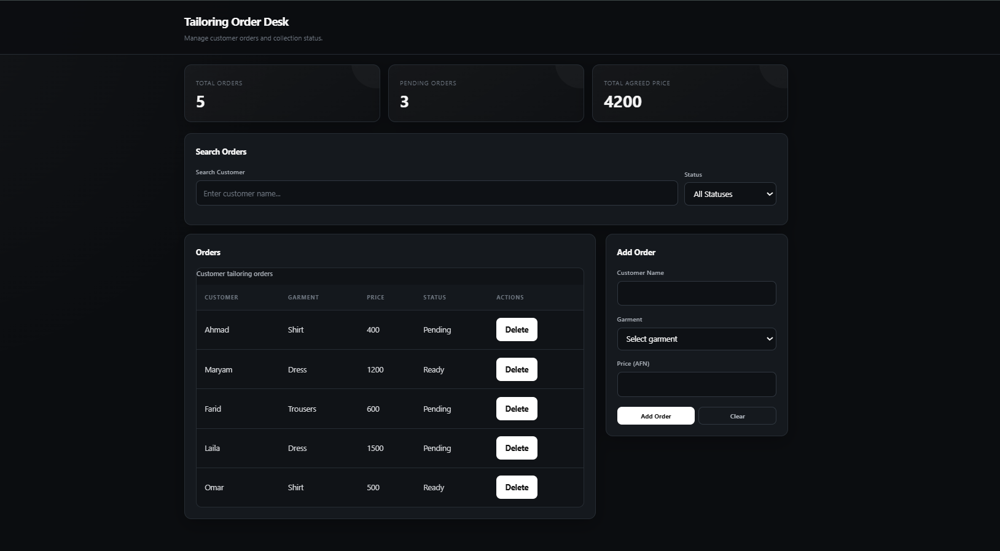

# 🛠️ Workshop Management

A JavaScript-based workshop management application for managing products and displaying product prices in a simple and interactive interface.

## ✨ Features

* ➕ Add products
* 🗑️ Delete products
* 🔍 Search products
* 💰 Display product prices
* ⚡ Interactive JavaScript functionality

## 🛠️ Technologies

* HTML5
* CSS3
* JavaScript

## 🚀 How to Run

1. Clone the repository:

   ```bash
   git clone https://github.com/aminrasooli2007-svg/workshop-management.git
   ```

2. Open the project folder.

3. Open `index.html` in your browser.

## 🎯 Project Goal

This project was built to practice JavaScript logic, DOM manipulation, user interactions, and managing product data.

---

### 👨‍💻 Author

**Amin Rasooli**

[GitHub](https://github.com/aminrasooli2007-svg) · [LinkedIn](https://www.linkedin.com/in/amin-rasooli-8325b4408/)
